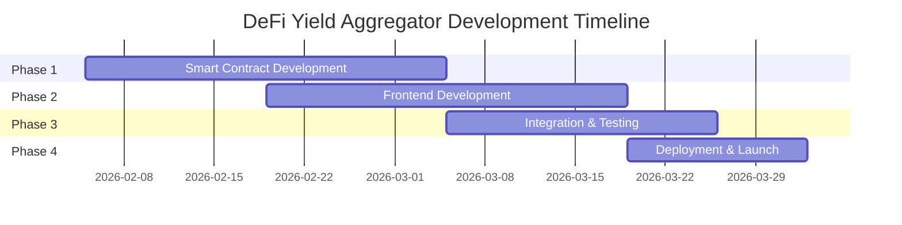

# DeFi Yield Aggregator - Code Review Phases Index

> **Project**: DeFi Yield Aggregator  
> **Total Phases**: 4  
> **Total Tasks**: 55  
> **Estimated Timeline**: 8 Weeks

---

## Phase Overview



---

## Phase Summary

| Phase | Name | Tasks | Priority | Timeline |
|-------|------|-------|----------|----------|
| [Phase 1](./CODE_REVIEW_PHASE1_SMART_CONTRACT_DEVELOPMENT.md) | Smart Contract Development | 15 | Critical | Weeks 1-4 |
| [Phase 2](./CODE_REVIEW_PHASE2_FRONTEND_DEVELOPMENT.md) | Frontend Development | 17 | High | Weeks 3-6 |
| [Phase 3](./CODE_REVIEW_PHASE3_INTEGRATION_TESTING.md) | Integration & Testing | 13 | Critical | Weeks 5-7 |
| [Phase 4](./CODE_REVIEW_PHASE4_DEPLOYMENT_LAUNCH.md) | Deployment & Launch | 10 | Critical | Weeks 7-8 |

---

## Task ID Conventions

| Phase | Prefix | Example |
|-------|--------|---------|
| Phase 1 - Smart Contracts | `P1-SC-XXX` | P1-SC-001 |
| Phase 2 - Frontend | `P2-FE-XXX` | P2-FE-001 |
| Phase 3 - Integration | `P3-IT-XXX` | P3-IT-001 |
| Phase 4 - Deployment | `P4-DL-XXX` | P4-DL-001 |

---

## Technology Stack

| Layer | Technology |
|-------|------------|
| Smart Contracts | Solidity ^0.8.x |
| Development | Hardhat |
| Blockchain | Ethereum |
| Frontend | React + TypeScript |
| Web3 | Web3.js |
| Styling | TailwindCSS |
| Testing | Vitest, Playwright, Foundry |

---

## Key Deliverables by Phase

### Phase 1: Smart Contract Development
- ✅ ERC-4626 Vault Contract
- ✅ Strategy Manager
- ✅ Protocol Adapters (Aave, Compound, Curve)
- ✅ Security Controls
- ✅ Comprehensive Test Suite

### Phase 2: Frontend Development
- ✅ React Dashboard
- ✅ Web3.js Integration
- ✅ Deposit/Withdraw Interface
- ✅ Strategy Monitoring
- ✅ Portfolio Analytics

### Phase 3: Integration & Testing
- ✅ End-to-End Integration
- ✅ Security Analysis (Slither/Mythril)
- ✅ Testnet Deployment
- ✅ Mainnet Fork Testing
- ✅ Audit Preparation

### Phase 4: Deployment & Launch
- ✅ Mainnet Deployment
- ✅ Multi-Sig Setup
- ✅ Bug Bounty Program
- ✅ Production Monitoring
- ✅ Launch Communications

---

## Success Metrics

| Metric | Target |
|--------|--------|
| Test Coverage | ≥ 90% |
| Gas per Rebalance | < 200,000 |
| Lighthouse Performance | ≥ 90 |
| Security Vulnerabilities | 0 Critical/High |
| APY Improvement | 30%+ vs single-protocol |

---

## Quick Navigation

1. **[Phase 1: Smart Contracts](./CODE_REVIEW_PHASE1_SMART_CONTRACT_DEVELOPMENT.md)** - Core contracts, strategies, security
2. **[Phase 2: Frontend](./CODE_REVIEW_PHASE2_FRONTEND_DEVELOPMENT.md)** - React UI, Web3 integration
3. **[Phase 3: Integration](./CODE_REVIEW_PHASE3_INTEGRATION_TESTING.md)** - Testing, security analysis
4. **[Phase 4: Launch](./CODE_REVIEW_PHASE4_DEPLOYMENT_LAUNCH.md)** - Mainnet, monitoring, launch

---

## Getting Started

```bash
# Clone the repository
git clone <repository-url>
cd defi-yield-aggregator

# Install dependencies
npm install

# Start development
npm run dev
```

---

*Last Updated: 2026-02-04*
